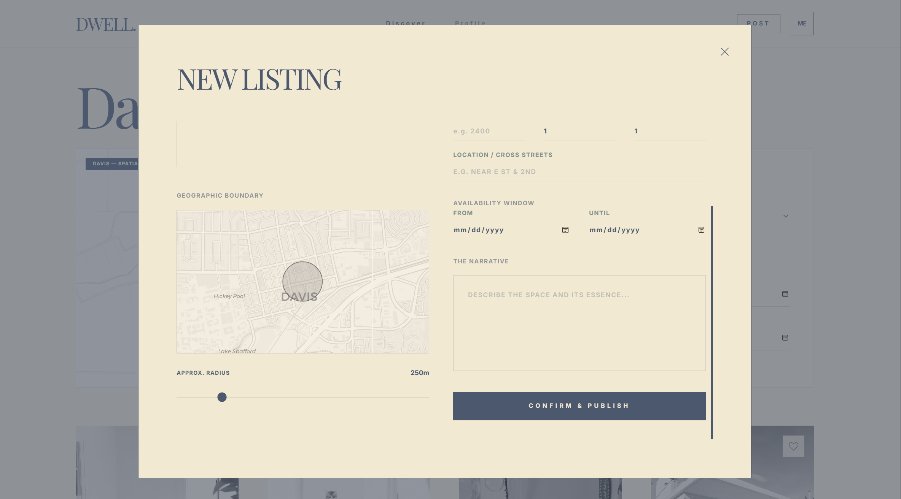

# Go Microservices Project

This project implements a **microservices-based architecture in Go**, designed around clear service boundaries, asynchronous event handling, and scalable infrastructure.
It includes services for **authentication, mail delivery, logging, a broker API gateway**, and a newly added **Post / Rent List service backed by PostgreSQL and exposed via a RESTful API**.

The system supports **JWT-based authentication**, **Google OAuth**, **email verification**, **event-driven logging with RabbitMQ**, and **CRUD operations against PostgreSQL**.

<table>
  <tr>
    <!-- 左边一列 -->
    <td width="55%" align="center">
      
    </td>
	<td align="center">
      
      
    </td>

  </tr>
</table>

## Architecture Overview

The system consists of the following services:

### Core Services

- **Broker Service**

  - Acts as an API Gateway.
  - Routes incoming HTTP requests to downstream microservices.
  - Centralizes request validation and orchestration.

- **Authentication Service**

  - Handles:

    - User registration and login
    - JWT access & refresh token generation
    - Google OAuth login
    - Email verification via one-time codes

  - Uses:

    - PostgreSQL for persistent user data
    - Redis for verification codes and token-related state

- **Mail Service**

  - Sends verification and notification emails.
  - Uses SMTP configuration provided via environment variables.

- **Logger Service**

  - Receives structured log events.
  - Publishes and consumes log messages via RabbitMQ.

- **Listener Service**

  - Subscribes to RabbitMQ queues.
  - Processes asynchronous events (e.g., logging, audit events).

---

### Domain Services

- **Post / Rent List Service (NEW)**

  - Provides a RESTful API for managing rental posts.
  - Supports CRUD operations on rent listings.
  - Uses PostgreSQL as the primary datastore.
  - Designed to be consumed by:

    - The Broker Service
    - Authenticated front-end clients

  - Enforces authorization via JWT middleware.

---

### Front-end

- **Go-based Web Server**

  - Serves as a lightweight backend for UI integration.

- **TypeScript / React Front-end**

  - User-facing application.
  - Supports authentication, verification flows, and rent list interaction.

---

### Communication & Infrastructure

- **Service-to-service communication:** HTTP (REST)
- **Asynchronous messaging:** RabbitMQ
- **Persistent storage:** PostgreSQL
- **Caching / temporary state:** Redis
- **Containerization:** Docker & Docker Compose

---

## System Architecture Diagram (Conceptual)

```
Client (React)
     |
     v
Broker Service (API Gateway)
     |
     +--> Auth Service ----> PostgreSQL / Redis
     |
     +--> Post Service ----> PostgreSQL
     |
     +--> Mail Service ----> SMTP
     |
     +--> Logger Service --> RabbitMQ --> Listener
```

---

## Prerequisites

- Docker & Docker Compose
- Go 1.19+ (for local builds)
- Node.js 18+ (for front-end development)

---

## Quick Start

1. **Clone the repository**

   ```bash
   git clone <your-repo-url>
   cd <project-directory>
   ```

2. **Create environment variables**

   - Copy `.env.example` (if provided) or define variables directly.
   - Refer to `docker-compose.yml` for required values.

3. **Build and start all services**

   ```bash
   make up_build
   ```

---

## Building and Running

### Using Makefile

| Command            | Description                             |
| ------------------ | --------------------------------------- |
| `make up_build`    | Build all services and start containers |
| `make up`          | Start services without rebuilding       |
| `make down`        | Stop and remove containers              |
| `make build_auth`  | Build authentication service only       |
| `make build_front` | Build front-end                         |
| `make start`       | Start front-end                         |
| `make stop`        | Stop front-end                          |

---

### Manual Docker Compose

```bash
docker-compose up --build
```

---

## Configuration

All configuration is managed via environment variables defined in `docker-compose.yml`.

### Key Variables

#### Database (PostgreSQL)

- `DATABASE_URL`
- `POSTGRES_USER`
- `POSTGRES_PASSWORD`
- `POSTGRES_DB`

#### Redis

- `REDIS_HOST`
- `REDIS_PORT`

#### OAuth (Google)

- `GOOGLE_CLIENT_ID`
- `GOOGLE_CLIENT_SECRET`
- `GOOGLE_REDIRECT_URL`

#### Mail (SMTP)

- `SMTP_HOST`
- `SMTP_PORT`
- `SMTP_USER`
- `SMTP_PASSWORD`

#### JWT

- `JWT_SECRET`
- `JWT_REFRESH_SECRET`

---

### Post / Rent List Service (NEW)

Base path: `/posts`

| Method | Endpoint      | Description            |
| ------ | ------------- | ---------------------- |
| POST   | `/posts`      | Create a new rent post |
| GET    | `/posts`      | List all rent posts    |
| GET    | `/posts/{id}` | Get a single post      |
| PUT    | `/posts/{id}` | Update a post          |
| DELETE | `/posts/{id}` | Delete a post          |

**Authorization**

- Requires a valid JWT access token.
- Token is validated by middleware.

---

### Mail Service

- `POST /send`

---

## Service Details

### Authentication Service

- JWT access & refresh tokens
- Email verification codes stored in Redis
- OAuth2 integration with Google

### Post Service

- RESTful API design
- PostgreSQL schema managed via migrations
- Clean separation of:
  - handlers
  - services
  - repositories
- Designed for extension (pagination, filtering, search)

### Mail Service

- Generates and sends verification emails
- Configurable SMTP provider
- Implemented in `mail_service.go`

### Broker Service

- Central request dispatcher
- Forwards requests using functions such as `forwardToAuthService`
- Simplifies client-side API usage

### Logger & Listener Services

- Event-driven architecture using RabbitMQ
- Decouples logging from request lifecycle
- Supports future observability extensions

---

## License

MIT License
